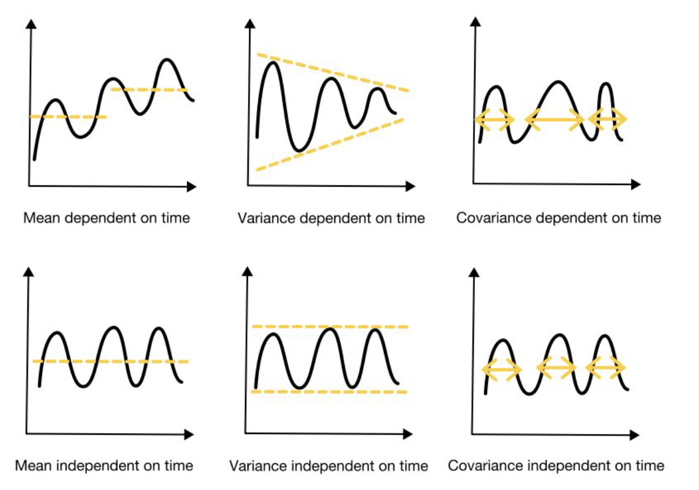
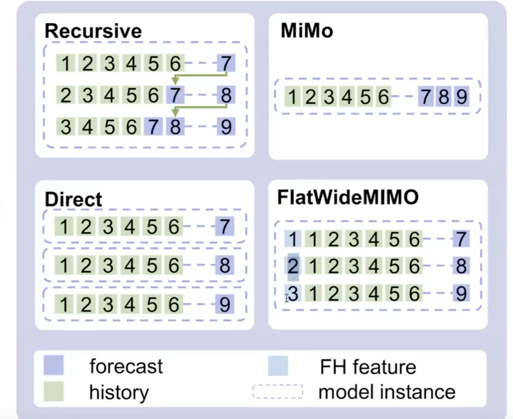

#  Cтационарность

Представь, что ты пытаешься предсказать поведение человека. Если его настроение и привычки постоянны (он всегда пьет кофе в 8 утра, а если злится — то одинаково сильно), его поведение легко предсказать. Если же он меняется хаотично: сегодня пьет кофе, завтра улетает на Марс, а послезавтра впадает в депрессию — предсказать что-либо невозможно.

В мире данных **стационарный временной ряд** — это ряд, у которого **статистические свойства не меняются со временем**.

Чтобы ряд считался (слабо) стационарным, должны выполняться три жестких условия:

1.  **Постоянное математическое ожидание (среднее значение).**
    *   *Простыми словами:* У ряда нет тренда. Он не растет вечно вверх и не падает вниз. Он колеблется вокруг одной горизонтальной линии.
    *   *Пример:* Если график цены акции ползет вверх годами — это **не** стационарный ряд.

2.  **Постоянная дисперсия (вариативность).**
    *   *Простыми словами:* Размах колебаний (волатильность) остается одинаковым. Ряд не должен вести себя спокойно в начале года, а к концу года начинать «беситься» с огромными скачками.
    *   *Пример:* Если сейсмограф рисует тонкую линию, а потом начинаются дикие амплитуды землетрясения — дисперсия изменилась, стационарности нет.

3.  **Постоянная автоковариация (связь зависит только от сдвига во времени).**
    *   *Простыми словами:* Связь между «сегодня» и «вчера» такая же, как между «прошлым вторником» и «прошлым понедельником». Важно лишь расстояние между точками (лаг), а не то, в каком году мы находимся.


> **Как проверить:** Визуально (график должен быть похож на «шум» вокруг горизонтали) или тестом Дики-Фуллера  (Augmented Dickey-Fuller test, ADF) или тестом KPSS.




# Перевод из long в wide

Это одни и те же данные, просто по-разному организованные.

### 1. Long Format (Длинный)
**Суть:** Одна строка = одно наблюдение. Таблица растет **вниз**.
Это то, как данные лежат в базе (SQL) или подаются в `LGBMRegressor` / `CatBoost`.

| Date | Ticker (ID) | Price (Target) |
| :--- | :--- | :--- |
| 2024-01-01 | **AAPL** | 150 |
| 2024-01-01 | **MSFT** | 300 |
| 2024-01-02 | **AAPL** | 155 |
| 2024-01-02 | **MSFT** | 305 |


---

### 2. Wide Format (Широкий)
**Суть:** Одна строка = один момент времени. Таблица растет **вправо**.
Это то, что нужно для матрицы корреляций, PCA или моделей вроде VAR.

| Date | Price_AAPL | Price_MSFT |
| :--- | :--- | :--- |
| 2024-01-01 | 150 | 300 |
| 2024-01-02 | 155 | 305 |


---

# Feature Engeeniring

### 1. Золотое правило: "Не заглядывай в $t$" (Shift & Horizon)

Прежде чем создавать любой лаговый признак или скользящее среднее, нужно понять одну вещь:

**Когда мы предсказываем точку $t$, мы не знаем ничего, что происходило в момент $t$, и часто не знаем, что было в $t-1$, $t-2$... в зависимости от горизонта прогноза.**

Если нам нужно предсказать продажи **на завтра** (горизонт = 1 день), мы можем использовать данные за "вчера" ($t-1$).
Но если мы предсказываем продажи **на 14 дней вперед**, то в момент прогноза у нас не будет данных за $t-1, \dots, t-13$. У нас будут только данные 14-дневной давности.

> **Как это делается в коде:**
> Всегда делай `shift(n)` (сдвиг) перед расчетом оконных функций или лагов. Он сдвигает на n шагов назад. n+1 - ое значение будет = 1-му, а все до него = None
> *   Для прогноза на 1 шаг вперед: сдвиг минимум на 1.
> *   Для прогноза на K шагов вперед: сдвиг минимум на K.

---

### 2. Разбор признаков (Feature Engineering)


#### А. Календарные признаки (Calendar Features)
Модели деревьев не понимают непрерывное время. Им нужно объяснить контекст.

*   **Базовые:** День недели, месяц, день месяца, год, номер недели.
*   **Is_Weekend / Is_Holiday:** Бинарные флаги (0 или 1). Продажи в субботу и вторник кардинально отличаются.
*   **Wavelet признаки**
*   **Циклические (Sin/Cos transform):** *Разложение Фурье*
    Машина думает, что месяц 12 (Декабрь) и 1 (Январь) — это далеко (разница 11). На самом деле они соседи.
    Мы берем `sin` и `cos` от времени, чтобы замкнуть круг.
    ```python
    df['month_sin'] = np.sin(2 * np.pi * df['month'] / 12)
    df['month_cos'] = np.cos(2 * np.pi * df['month'] / 12)
    ```

#### Б. Лаговые признаки (Lags)
Самый мощный предиктор будущего — это недавнее прошлое.

*   **Классические лаги:** Значение вчера ($t-1$), неделю назад ($t-7$), год назад ($t-365$).
    *   *Зачем:* $t-7$ ловит недельную сезонность (в прошлую пятницу продажи были высокие -> в эту, скорее всего, тоже).
*   **Дифференциирование (Diffs):**
    Вместо сырой цены берем разницу: `price(t-1) - price(t-2)`.
    *   *Зачем:* Это удаляет тренд и делает ряд стационарным. Деревья плохо предсказывают значения за пределами того, что видели в обучении (экстраполяция тренда). Разности позволяют модели понять *динамику* (рост/падение), а не абсолютные числа.

#### В. Групповые статистики (Window Statistics / Rolling)
Это "сглаженное" представление прошлого. Оно убирает шум одиночных выбросов.

*   **Rolling Mean (Скользящее среднее):** Тренд за последнюю неделю/месяц.
*   **Rolling Std (Скользящее отклонение):** Волатильность. Если `std` растет, значит рынок "трясет", и модели сложнее сделать точный прогноз.
*   **Min/Max:** Диапазон значений за окно.

> **⚠️ Опасность утечки здесь:**
> Нельзя считать `mean` включая текущую точку!
> Неправильно: `df['sales'].rolling(window=7).mean()` (в Pandas по умолчанию окно включает правый край).
> Правильно: `df['sales'].shift(1).rolling(window=7).mean()` — **Сначала сдвинули, потом посчитали.**

#### Г. Признаки на основе статистических моделей (Hybrid/Stacking)
Это продвинутый уровень. Мы используем простые модели, чтобы помочь сложной.

*   **Предсказания ARIMA/ETS/Prophet:** Мы можем обучить легкую модель (например, Prophet), получить от неё прогноз тренда, и подать этот прогноз как **фичу** (колонку) в CatBoost.
*   **STL декомпозиция:** Можно разложить ряд на `Trend`, `Seasonality` и `Residuals` заранее и подать их как три отдельные колонки. Дереву будет проще понять структуру данных.

---
Отлично. Давай разберем эти три подхода, строго следуя логике схемы, которую ты прислал. В ней главное отличие — **как мы формируем матрицу $X$ (входные данные)** и **какую размерность имеет $Y$ (выход)**.

Представим, что у нас есть два киоска: **Киоск А** и **Киоск Б**.

---

# Стратегии прогнозирования нескольких временных рядов

### 1. Стратегия Local (Локальная)
**Суть:** "Разделяй и изолируй".
Мы вообще не смешиваем данные киосков. Мы считаем, что продажи Киоска А никак не зависят от Киоска Б и подчиняются своим уникальным законам.

*   **Количество моделей:** $N$ (сколько рядов, столько моделей).
*   **Сложность данных:** Низкая.
*   **Где применяется:** Когда рядов мало (< 50) и они совсем разные (например, курс биткоина и температура в Антарктиде).

#### Пример данных для обучения
У нас будет **2 отдельные таблицы**.

**Для Модели А (обучаем ARIMA №1):**
| Date | $X_{lag}$ (Вчера А) | **$Y$ (Сегодня А)** |
|:---|:---|:---|
| 01.01 | 100 | **105** |
| 02.01 | 105 | **102** |

**Для Модели Б (обучаем ARIMA №2):**
| Date | $X_{lag}$ (Вчера Б) | **$Y$ (Сегодня Б)** |
|:---|:---|:---|
| 01.01 | 500 | **520** |
| 02.01 | 520 | **510** |

---

### 2. Стратегия Multivariate (Векторная / Широкая)
**Суть:** "Всё влияет на всё".
Мы считаем, что чтобы предсказать продажи Киоска А, нам **жизненно важно** знать, сколько вчера продал Киоск Б. Ряды "переплетены".
*   **Количество моделей:** 1 (но сложная, с мульти-выходом) или $N$ (по одной на ряд, но каждая видит входные данные всех остальных).
*   **Сложность данных:** Высокая. Количество колонок растет лавинообразно.
*   **Где применяется:** Взаимосвязанные системы (датчики одного двигателя, валютные пары, конкурирующие товары "Кола vs Пепси").

#### Пример данных для обучения
У нас **одна широкая (Wide) таблица**. Смотри на колонки $X$:

| Date | $X_{lag\_A}$ (Вчера А) | $X_{lag\_B}$ (Вчера Б) | -> | **$Y_A$ (Сегодня)** | **$Y_B$ (Сегодня)** |
|:---|:---|:---|:---|:---|:---|
| 01.01 | 100 | 500 | -> | **105** | **520** |
| 02.01 | 105 | 520 | -> | **102** | **510** |

**Важный момент:**
В одной строке (в векторе признаков) лежит история **сразу обоих** магазинов. Модель видит корреляцию между 100 и 500.

---

### 3. Стратегия Global (Глобальная / Стекинг)
**Суть:** "Обобщение опыта".
Мы не объединяем признаки в ширину (как в Multivariate). Мы ставим ряды **друг на друга (stacking)**.
Модель учит **универсальную формулу** продаж. Она не видит в одной строке данные соседа (Киоска Б), но она выучила на данных Киоска Б, что "в субботу продажи растут", и применяет это знание к Киоску А.

*   **Количество моделей:** 1 (одна на всех).
*   **Сложность данных:** Средняя. Таблица длинная (Long), но узкая.
*   **Где применяется:** Ритейл (100,000 товаров), банкоматы, веб-трафик. Стандарт SOTA (Kaggle).

#### Пример данных для обучения
У нас **одна длинная (Long) таблица**.

| Date | ID | $X_{lag}$ (Вчерашние продажи **этого** ID) | **$Y$ (Сегодняшние продажи **этого** ID)** |
|:---|:---|:---|:---|
| 01.01 | **А** | 100 | **105** |
| 01.01 | **Б** | 500 | **520** |
| 02.01 | **А** | 105 | **102** |
| 02.01 | **Б** | 520 | **510** |

**Внимание на разницу с Multivariate:**
В строке, где `ID = A`, **НЕТ данных о продажах магазина Б**.
Признаки наблюдений **не пересекаются** . Изоляция в рамках строки, но объединение в рамках обучающей выборки.

---

### Какой подход выбрать ?

1.  **Local:** Если киоск А продает мороженое в Москве, а киоск Б продает валенки в Норильске. Им нечего сказать друг другу. Делаем две модели.
2.  **Multivariate:** Если это курс Доллара ($A$) и курс Евро ($B$). Если Евро падает, Доллар реагирует мгновенно. Модели нужно видеть оба значения в одну секунду. **Wide формат.**
3.  **Global:** Если это сеть "Пятерочка". 20,000 магазинов. Они не влияют друг на друга напрямую (продажи в Москве не зависят от продаж в Казани прямо сейчас), но они живут по одним законам (Новый год, Черная пятница). Мы учим одну модель "понимать торговлю". **Long формат.**


# Стратегии многошагового прогнозирования



---

### 1. Recursive (Рекурсивная стратегия)

Это классический подход "шаг за шагом".
1.  У нас есть история (1-6). Мы обучаем модель предсказывать **один шаг** вперед ($t+1$).
2.  Модель предсказывает точку **7**.
3.  **Магия:** Мы берем это предсказание (7) и **добавляем** его ко входу, как будто это настоящая история.
4.  Спрашиваем модель снова. Теперь она видит (2-7) и предсказывает точку **8**.
5.  Повторяем до горизонта прогноза.

*   **Плюсы:** Нужна всего **одна модель**. Она легкая и простая.
*   **Минусы:** **Накопление ошибки (Error Propagation)**. Если модель ошиблась в точке 7, то прогноз точки 8 будет опираться на ошибку, а точка 9 — на ошибку в квадрате. К концу прогноза точность может сильно упасть.
*   **Для кого:** Дефолтный выбор для ARIMA, Prophet и простых решений на базе GBDT.

---

### 2. Direct (Прямая стратегия)

"Каждому горизонту — своя модель".
Мы обучаем **отдельную модель** для каждого шага в будущее.
*   **Модель 1:** Учится на истории (1-6) предсказывать точку **7**.
*   **Модель 2:** Учится на истории (1-6) предсказывать точку **8**. (Она игнорирует точку 7, она её не знает).
*   **Модель 3:** Учится на истории (1-6) предсказывать точку **9**.

*   **Плюсы:** **Нет накопления ошибки**. Модель 3 специально заточена предсказывать "через 3 дня", не опираясь на возможные ошибки Модели 1 и 2. Качество на дальних горизонтах обычно выше.
*   **Минусы:** Нужно обучать и поддерживать $H$ моделей (где $H$ — горизонт). Если прогноз на 30 дней, нужно 30 моделей. Это дорого и долго.
*   **Для кого:** Золотой стандарт для бустингов (LightGBM/XGBoost), если горизонт небольшой (например, до 14 дней).

---

### 3. MiMo (Multi-Input Multi-Output)

Модель устроена так, что она принимает историю (1-6) и на выходе выдает **сразу вектор** [7, 8, 9].
Одна модель предсказывает всю последовательность целиком за один проход.

*   **Плюсы:**
    *   Одна модель.
    *   **Согласованность:** Модель может выучить зависимость между точкой 7 и 8 (например, "если 7 высокая, то 8 тоже должна быть высокой"). В стратегии *Direct* модели независимы и могут выдать несогласованный "разнобой".
*   **Минусы:**
    *   Сложнее учить.
    *   **Градиентный бустинг (XGBoost/CatBoost) НЕ УМЕЕТ так делать нативно.** Они предсказывают одно число. Чтобы реализовать MiMo на бустинге, нужна специальная обертка (`MultiOutputRegressor`), которая под капотом всё равно сделает *Direct*.
*   **Для кого:** Это родная стихия **Нейросетей** (LSTM, Transformers, MLP). Они всегда имеют выходной слой размерности $H$.

---

### 4. FlatWideMIMO (Global Horizon Approach)
Это хитрый трюк, чтобы сделать *Direct* стратегию, но использовать только **одну модель** (как в *Recursive*), при этом **не накапливать ошибку**.

Мы превращаем "горизонт прогноза" (насколько далеко смотрим) в **фичу** (признак).
Смотри на маленький синий квадратик в начале строк (FH feature).

Мы создаем обучающую выборку, где дублируем историю:
1.  Строка 1: `[Фича: +1 шаг]`, `[История 1-6]` -> Цель: **7**
2.  Строка 2: `[Фича: +2 шага]`, `[История 1-6]` -> Цель: **8**
3.  Строка 3: `[Фича: +3 шага]`, `[История 1-6]` -> Цель: **9**

Мы обучаем одну мощную модель на этом длинном датасете. Когда хотим прогноз, мы подаем ей одни и те же данные, но меняем "Фичу шага".

*   **Плюсы:** Одна модель вместо пачки (как в Direct). Нет накопления ошибки (как в Recursive).
*   **Минусы:** Модели сложно выучить физику процесса. Ей нужно понять, что при `Фича=+1` зависимость от лагов одна, а при `Фича=+10` — зависимость слабее. Не всегда работает хорошо.
*   **Для кого:** Хорошо работает в Global-моделях (на больших датасетах), когда Direct слишком дорого, а Recursive слишком неточен.
